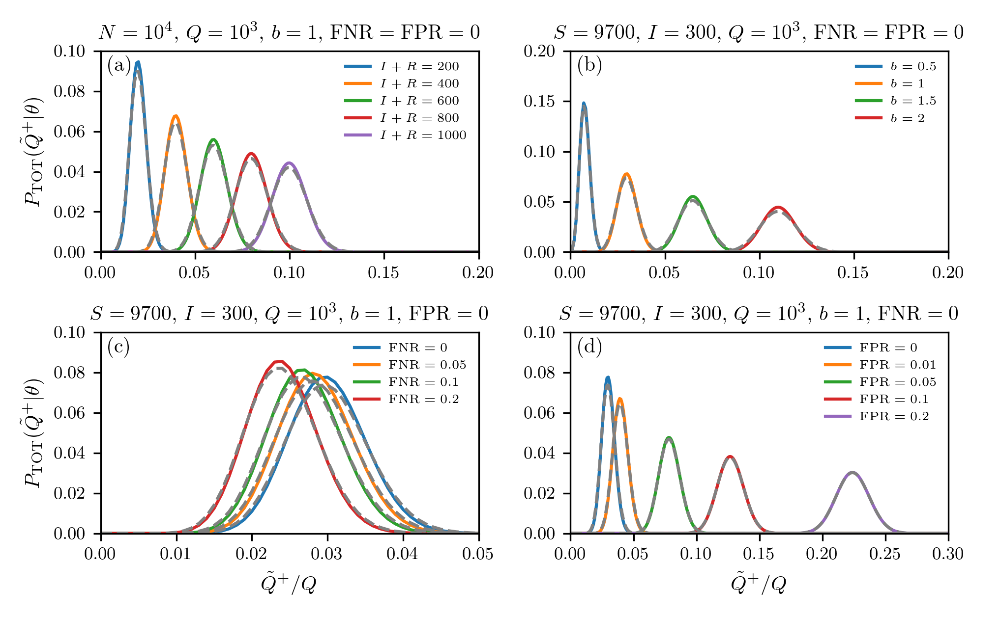

# disease-testing

## Project Description

This project enables users to generate random and biased testing distributions.

You can simply run the examples ``testing_analytical_replacement_false.py`` and ``testing_analytical_replacement_true.py`` in the ``src`` folder and plot the generated results with ``testing_plot.py``. The resulting plot should look like this one:

In addition, you can also run the files in ``excess_deaths'' to compute different mortality measures. (Make sure that you download the most recent source data, see below.)

## Related Data Sources

* https://raw.githubusercontent.com/nytimes/covid-19-data/master/live/us-states.csv
* https://raw.githubusercontent.com/CSSEGISandData/COVID-19/master/csse_covid_19_data/csse_covid_19_daily_reports
* https://github.com/TheEconomist/covid-19-excess-deaths-tracker
