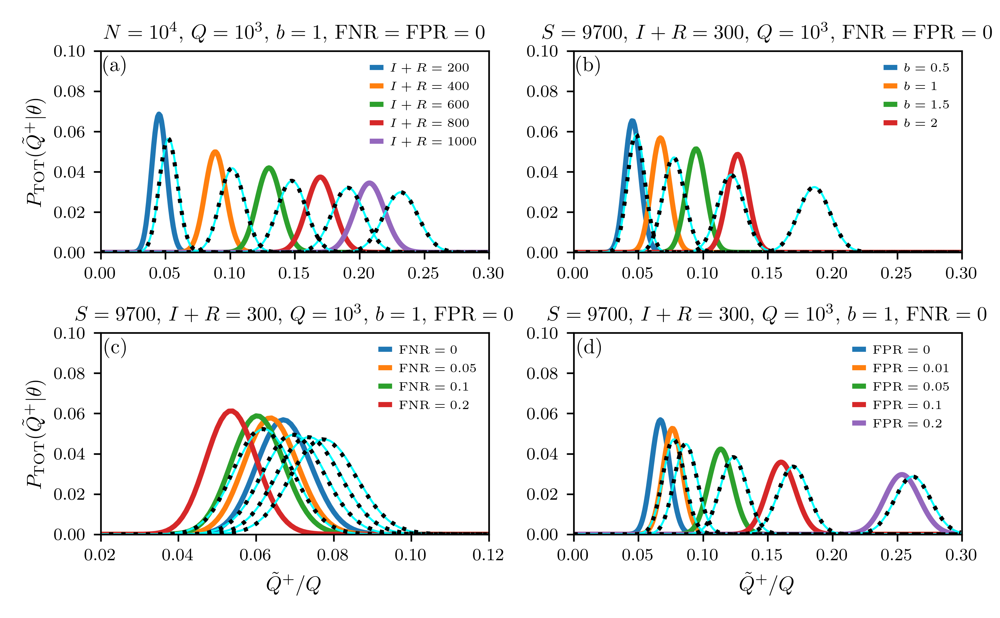

# disease-testing

This project enables users to generate random and biased testing distributions.

You can simply run the examples ``testing_analytical_replacement_false.py`` and ``testing_analytical_replacement_true.py`` in the ``src`` folder and plot the generated results with ``testing_plot.py``. The resulting plot should look like this one:

